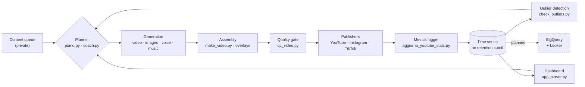

# Calciovich Content Pipeline

**A production system that generates and publishes video content to three platforms on a
daily cadence — and accumulates the performance data those platforms return.**

The pipeline reads the state of a content queue, decides what to produce under a weekly
rotation, generates the video, renders a contact sheet for visual review, publishes it,
and updates registries, playlists and state as it goes. Orchestration is handled by an
AI agent (Claude Code) driving the scripts in this repo.

Two honest caveats about "unattended": the visual QC step **produces a contact sheet for
a human to look at — it does not gate the publishers**, and TikTok publishing goes to an
Inbox draft that the account owner confirms in the app, because the project's TikTok app
has not cleared platform audit. YouTube and Instagram publish without intervention.

Alongside publishing, the system records what happens afterwards: a historical logger
accumulates channel metrics with no retention cutoff, and an outlier detector scores
each release against the rolling median of its own format. Today that measurement layer
is deliberately thin — a daily trigger and a local dashboard. **Turning the accumulated
time series into a proper analytics stack is the next phase of the project** (see
[Roadmap](#roadmap)).

## Data flow

Measurement feeds back into what gets produced next. The dashed branch is the roadmap,
not shipped.

## Measurement layer (today)

- **`aggiorna_youtube_stats.py`** — historical logger for subscribers, views and
  followers, running on a `LaunchAgent` schedule with **no retention cutoff**. Platform
  APIs expose rolling windows; keeping the full series locally is what makes trend and
  cohort analysis possible later.
- **`check_outliers.py`** — compares the latest release in each format against the
  **median lifetime view count of previous releases in the same format** (YouTube Data
  API v3, `videos.list`), requiring at least 3 prior releases before it trusts the
  baseline, and flags outliers (`WIN ≥5×`, `FAIL ≤0.2×`). Per-format baselines matter: a
  short-form clip and a long-form episode have distributions that can differ by two
  orders of magnitude, so a single global threshold produces nothing but false signals.

  **Known limitation, stated deliberately:** comparing a hours-old video against the
  *lifetime* totals of older ones is not a valid comparison — a new release is
  structurally biased toward `FAIL`. The statistically correct version compares a fixed
  window from each video's own publication (views at 24h / 48h / 168h), which requires
  the Analytics API rather than Data API totals. That is part of the warehouse work in
  the [Roadmap](#roadmap); until then the `FAIL` side of this signal should be read as a
  prompt to look, not as a verdict.
- **`app_server.py`** — local HTTP server backing a dashboard over pipeline state and
  the accumulated metrics, regenerating its data on every start.

**Design note on the alerting cadence.** Outlier detection is a *lightweight daily
trigger*, deliberately not a replacement for a periodic review. It answers "is this one
release obviously off the scale?" — a question worth answering within hours. Slower
questions (is a format decaying? is the audience shifting?) need more observations and
belong to a review on a fixed cadence. Conflating the two produces either alert fatigue
or slow detection.

## Production pipeline

**Generation**
- `genera_video_ai.py` — AI video clips (Seedance via PiAPI) with a consistently
  recognizable character face, using canonical reference images (`omni_reference`)
  instead of leaving the model free rein. Automatically expands prompt placeholders
  (`{KIT}`, `{BROADCAST}`, `{SCENE_LOCK}`) from a shared set of canonical clauses, so
  hand-written prompts stay short instead of accumulating defensive boilerplate with
  every fix.
- `genera_immagini.py` / `genera_immagini_free.py` / `genera_foto_ai.py` — character
  illustrations and "archive" photos, on a paid provider (Seedream) or a free one
  (Pollinations) depending on how much framing precision the shot needs.
- `genera_voci.py` / `genera_voci_free.py` — neural voiceover (edge-tts, free) for
  the long-form audiobook format.
- `crea_audiolibro.py` / `make_video.py` — assemble book chapters, illustrations,
  voiceover and music into edited videos (Ken Burns pans, synced subtitles, episode
  badges).
- `overlay_broadcast.py` / `overlay_motivational.py` — TV-broadcast-style graphics
  (scoreboard, player name, synced play-by-play commentary) composited with
  PIL/ffmpeg, with safe-margin text placement verified against the native UI chrome
  of TikTok/Reels/Shorts (which covers the bottom of the frame during real playback).
- `genera_thumbnail.py` / `genera_certificato.py` — secondary graphic assets.

**Quality control**
- `qc_video.py` — a contact sheet of frames extracted at intervals, for a fast visual
  check of face consistency, camera work and brand compliance before publishing.

**Multi-platform publishing**
- `carica_youtube.py` — upload with scheduled `publishAt`, tags/description/category,
  and explicit handling of the daily quota-exceeded error.
- `carica_instagram.py` — Reels via the Meta Graph API: upload to S3-compatible
  storage (Cloudflare R2), container creation, polling, publish, comment, story.
- `carica_tiktok.py` — Content Posting API, with a fallback to an inbox draft when
  the app hasn't cleared the platform's audit yet.
- `gestisci_playlist.py` — creates and maintains YouTube playlists (by content
  series and by chronological order), including an automatic switch between two
  formats once one supersedes the other in content coverage.
- `rispondi_commenti.py` / `leggi_commenti.py` — comment-reply drafts in the
  character's voice, tuned per platform.

**Orchestration**
- `stato_pipeline.py` / `coach.py` / `piano.py` — queue status, goals and cadence.

## Notable engineering decisions

- **Deduplication across runs**: publishers deduplicate both on filename and on a stable
  item id (which survives a rename after a retry), and take a file lock so two runs of
  the same script never overlap.
  **What this does not yet cover**, and it is the most interesting open problem in the
  repo: the external effect happens *before* the local registry is written. If a platform
  accepts the upload but the process dies before `save_uploads()`, the registry has no
  record and a retry republishes. Closing that gap needs a transactional
  `pending → external_id → confirmed` state written atomically, plus reconciliation
  against the platform API before any retry — not a bigger lock.
- **Lean prompts**: direction/brand/kit clauses are never hand-pasted into a prompt —
  they're expanded from a shared template, so they stay identical to themselves
  instead of drifting as ad-hoc fixes pile up over time.
- **Free-first by default**: the pipeline always prefers whatever zero-cost format is
  available (already-paid-for content repurposed, free providers, local rendering)
  and reserves paid AI generation for the one format that must always be fresh. The
  per-run cost estimate is printed before generation; enforcing an actual budget ceiling
  from recorded spend is not implemented yet.
- **Per-format baselines, not global thresholds**: performance is scored against the
  median of the same format, because formats differ in scale by orders of magnitude and
  a shared threshold would only produce noise. See the limitation noted under
  `check_outliers.py` for what this baseline still gets wrong.

## Stack

Python 3 · Google API Client (YouTube Data API v3, YouTube Analytics API) · Meta
Graph API · TikTok Content Posting API · Cloudflare R2 (S3-compatible, via boto3) ·
PiAPI (Seedance/Seedream) · Pollinations · edge-tts · Pillow · ffmpeg (via
imageio-ffmpeg)

## Roadmap

The pipeline's job today is production and publishing. The metrics it accumulates are
still queried locally, from flat files, by a single-purpose dashboard — enough to answer
"is this release off the scale?", not enough to answer anything about how an audience
actually behaves over time.

The next phase moves that data onto a proper stack:

1. **Ingestion into BigQuery** — the channel time series and per-release metrics, from
   all three platforms, loaded on a schedule instead of read from local files.
2. **Dimensional modelling** — a warehouse layer over content, format, platform and
   date, so performance can be sliced by dimensions the platform APIs don't expose
   together.
3. **Looker** — reporting on top of the model, replacing the local dashboard.

The interesting questions only become answerable at that point: how retention differs by
format across platforms, whether a release's early trajectory predicts its ceiling, and
which content attributes correlate with sharing rather than with views.

## Repository scope

This repo holds the pipeline code only. The system it belongs to also has a private
half — credentials, the content queue, the editorial calendar, and the manuscript
itself — which stays in a separate private repository. That split is deliberate: the
engineering is worth showing, the content and the secrets are not.

Consequently the scripts here reference a configuration/data layer that isn't included,
and the repo is not a runnable demo. It documents the architecture and the
implementation choices of a system that runs in production every day.
