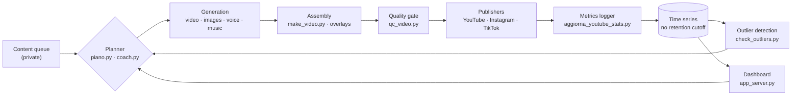

# Calciovich Content Pipeline

**A production content system for three streaming platforms — and the instrumentation
that turns its own output into a measurable dataset.**

The pipeline runs unattended every day: it reads the state of a content queue, decides
what to produce under a weekly rotation, generates the video, passes it through a
visual quality gate, publishes it to YouTube, Instagram and TikTok, and updates
registries, playlists and state as it goes. Orchestration is handled by an AI agent
(Claude Code) driving the scripts in this repo.

The part I care about most is the second half: **every release is measured.** A
historical logger accumulates channel metrics with no retention cutoff, an outlier
detector scores each new video against the rolling median of its own format, and a
dashboard reads the resulting time series. The system is the source of its own
analytics.

> **Context.** This is the *upstream* half of a pair of projects on the same domain.
> [Music Streaming Analytics](https://github.com/matteobalducci/music-streaming-analytics)
> models streaming event data (star schema, dbt, Power BI) and
> [Streaming Insights Copilot](https://github.com/matteobalducci/streaming-insights-copilot)
> puts a natural-language query layer over it. This repo is where the events come
> from.

## Data flow

The loop closes: measurement feeds back into what gets produced next.

## Measurement layer

- **`aggiorna_youtube_stats.py`** — historical logger for subscribers, views and
  followers, running on a `LaunchAgent` schedule with **no retention cutoff**. Platform
  APIs expose rolling windows; keeping the full series locally is what makes trend and
  cohort analysis possible later.
- **`check_outliers.py`** — compares each new release against the **rolling median of
  its own format** (YouTube Analytics API) and flags outliers immediately (`WIN ≥5×`,
  `FAIL ≤0.2×`). Per-format baselines matter: a short-form clip and a long-form episode
  have distributions that can differ by two orders of magnitude, so a single global
  threshold produces nothing but false signals.
- **`app_server.py`** — local HTTP server backing a dashboard over pipeline state and
  the accumulated metrics, regenerating its data on every start.

**Design note on the alerting cadence.** Outlier detection is a *lightweight daily
trigger*, deliberately not a replacement for a periodic review. It answers "is this one
release obviously off the scale?" — a question worth answering within hours. Slower
questions (is a format decaying? is the audience shifting?) need more observations and
belong to a review on a fixed cadence. Conflating the two produces either alert fatigue
or slow detection.

## Production pipeline

**Generation**
- `genera_video_ai.py` — AI video clips (Seedance via PiAPI) with a consistently
  recognizable character face, using canonical reference images (`omni_reference`)
  instead of leaving the model free rein. Automatically expands prompt placeholders
  (`{KIT}`, `{BROADCAST}`, `{SCENE_LOCK}`) from a shared set of canonical clauses, so
  hand-written prompts stay short instead of accumulating defensive boilerplate with
  every fix.
- `genera_immagini.py` / `genera_immagini_free.py` / `genera_foto_ai.py` — character
  illustrations and "archive" photos, on a paid provider (Seedream) or a free one
  (Pollinations) depending on how much framing precision the shot needs.
- `genera_voci.py` / `genera_voci_free.py` — neural voiceover (edge-tts, free) for
  the long-form audiobook format.
- `crea_audiolibro.py` / `make_video.py` — assemble book chapters, illustrations,
  voiceover and music into edited videos (Ken Burns pans, synced subtitles, episode
  badges).
- `overlay_broadcast.py` / `overlay_motivational.py` — TV-broadcast-style graphics
  (scoreboard, player name, synced play-by-play commentary) composited with
  PIL/ffmpeg, with safe-margin text placement verified against the native UI chrome
  of TikTok/Reels/Shorts (which covers the bottom of the frame during real playback).
- `genera_thumbnail.py` / `genera_certificato.py` — secondary graphic assets.

**Quality control**
- `qc_video.py` — a contact sheet of frames extracted at intervals, for a fast visual
  check of face consistency, camera work and brand compliance before publishing.

**Multi-platform publishing**
- `carica_youtube.py` — upload with scheduled `publishAt`, tags/description/category,
  quota handling and retries.
- `carica_instagram.py` — Reels via the Meta Graph API: upload to S3-compatible
  storage (Cloudflare R2), container creation, polling, publish, comment, story.
- `carica_tiktok.py` — Content Posting API, with a fallback to an inbox draft when
  the app hasn't cleared the platform's audit yet.
- `gestisci_playlist.py` — creates and maintains YouTube playlists (by content
  series and by chronological order), including an automatic switch between two
  formats once one supersedes the other in content coverage.
- `rispondi_commenti.py` / `leggi_commenti.py` — comment-reply drafts in the
  character's voice, tuned per platform.

**Orchestration**
- `stato_pipeline.py` / `coach.py` / `piano.py` — queue status, goals and cadence.

## Notable engineering decisions

- **Idempotency under concurrent runs**: publishers deduplicate both on filename and
  on a stable item id (survives a rename after a retry), and use a file lock so two
  runs of the same script never overlap.
- **Lean prompts**: direction/brand/kit clauses are never hand-pasted into a prompt —
  they're expanded from a shared template, so they stay identical to themselves
  instead of drifting as ad-hoc fixes pile up over time.
- **Free-first by default**: the pipeline always prefers whatever zero-cost format is
  available (already-paid-for content repurposed, free providers, local rendering)
  and reserves paid AI generation for the one format that must always be fresh —
  under a fixed spending cap and a hard retry limit per item.
- **Per-format baselines, not global thresholds**: performance is scored against the
  rolling median of the same format, because formats differ in scale by orders of
  magnitude and a shared threshold would only produce noise.

## Stack

Python 3 · Google API Client (YouTube Data API v3, YouTube Analytics API) · Meta
Graph API · TikTok Content Posting API · Cloudflare R2 (S3-compatible, via boto3) ·
PiAPI (Seedance/Seedream) · Pollinations · edge-tts · Pillow · ffmpeg (via
imageio-ffmpeg)

## Repository scope

This repo holds the pipeline code only. The system it belongs to also has a private
half — credentials, the content queue, the editorial calendar, and the manuscript
itself — which stays in a separate private repository. That split is deliberate: the
engineering is worth showing, the content and the secrets are not.

Consequently the scripts here reference a configuration/data layer that isn't included,
and the repo is not a runnable demo. It documents the architecture and the
implementation choices of a system that runs in production every day.
