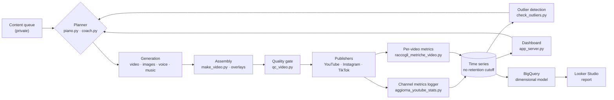

# Calciovich Content Pipeline

**A production system that generates and publishes video content to three platforms on a
daily cadence — and accumulates the performance data those platforms return.**

The pipeline reads the state of a content queue, decides what to produce under a weekly
rotation, generates the video, renders a contact sheet for visual review, publishes it,
and updates registries, playlists and state as it goes. Orchestration is handled by an
AI agent (Claude Code) driving the scripts in this repo.

Three honest caveats about "unattended": the visual QC step **produces a contact sheet for
a human to look at — it does not gate the publishers**; TikTok publishing goes to an
Inbox draft that the account owner confirms in the app, because the project's TikTok app
has not cleared platform audit; and automatic playlist maintenance currently fails by
design — writing to a playlist needs a broader OAuth scope than this project's token
carries, on purpose, after that broader scope previously caused a real production
incident (a token resolving to the wrong channel). Playlists are curated manually until
the app clears Google's verification. YouTube and Instagram publish without intervention.

Alongside publishing, the system records what happens afterwards: a historical logger
accumulates channel metrics with no retention cutoff, an outlier detector scores each
release against the median of previous releases in the same format, a BigQuery loader
turns that local state into a dimensional model — three fact tables, not one with a
fictional "platform" column, because engagement metrics only exist for YouTube; the
other two platforms are publish-event logs — and a **Looker Studio report on top of
that model** turns it into something a human can actually read (see
[Roadmap](#roadmap)).

## Data flow

Measurement feeds back into what gets produced next.

## Measurement layer (today)

- **`aggiorna_youtube_stats.py`** — historical logger for subscribers, views and
  followers, running on a `LaunchAgent` schedule with **no retention cutoff**. Platform
  APIs expose rolling windows; keeping the full series locally is what makes trend and
  cohort analysis possible later.
- **`raccogli_metriche_video.py`** — a per-video time series (`metriche_video.py`
  extracts the fetch/classification logic shared with `check_outliers.py`, so there is
  one source of truth for what a video's numbers are, not two that can quietly
  disagree), one snapshot per run of the shared `LaunchAgent`, guarded against
  overlapping executions the same way `carica_youtube.py` guards uploads (a
  non-blocking file lock, not just "one writer" as an assumption — this repo has
  already had a real incident from that exact gap). A freshness check surfaces in the
  dashboard if a collection run goes missing, independent of the trigger it's watching.
- **`check_outliers.py`** — compares the latest release in each format against the
  **median lifetime view count of previous releases in the same format** (YouTube Data
  API v3, `videos.list`), requiring at least 3 prior releases before it trusts the
  baseline, and flags outliers (`WIN ≥5×`, `FAIL ≤0.2×`). Per-format baselines matter: a
  short-form clip and a long-form episode have distributions that can differ by two
  orders of magnitude, so a single global threshold produces nothing but false signals.

  **Known limitation, partially addressed:** comparing a hours-old video against the
  *lifetime* totals of older ones is not a valid comparison — a new release is
  structurally biased toward `FAIL`. `raccogli_finestre_fisse.py` now pulls a fixed
  post-publish window (views at 24h / 48h / 168h) via the YouTube Analytics API — an
  OAuth token isolated from the one that publishes, on its own GCP project, so an
  expired or never-granted consent degrades to a status flag on the dashboard instead
  of touching publishing. `check_outliers.py` uses that window only when *both* the
  latest release and a same-format history of at least 3 prior releases have it —
  never a mix of fixed-window and lifetime numbers in the same median, which would
  just reintroduce the bias one level down. Until a format has accumulated enough
  same-window history, the comparison falls back to lifetime unchanged, and that
  `FAIL` side should still be read as a prompt to look, not as a verdict.
- **`raccogli_finestre_fisse.py`** — the fixed post-publish windows that fix the known
  limitation above, via the YouTube Analytics API. Its OAuth token is isolated on its
  own GCP project, never shared with the one that publishes — a lesson from a real
  incident where a broadened scope on the publishing token resolved to the wrong
  channel. Updates a window while a video is still within it (Analytics data on the
  most recent days can still be revised), freezes once it isn't; an expired or
  never-granted consent writes a status flag for the dashboard and skips the run
  cleanly instead of trying to open a browser from an unattended process.
- **`app_server.py`** — local HTTP server backing a dashboard over pipeline state and
  the accumulated metrics, regenerating its data on every start.
- **`carica_bigquery.py` / `dimensional_model.py`** — loads the state above into
  BigQuery as a small star schema: three fact tables, not one with a fictional
  "platform" column, because engagement metrics only exist for YouTube — Instagram
  and TikTok publishing is logged (confirmed/pending, raw platform-reported privacy)
  but never measured. `dimensional_model.py` is the pure-Python half (row
  construction, dedup, scope filtering) with zero dependency on the BigQuery SDK —
  same reason `metriche_video.py` has none, this repo's CI runs without it. Staging
  tables are replaced in full on every run rather than merged, because every local
  source already holds complete current state, not an incremental log — `examples/`
  has a runnable demo with no GCP credentials required.
- **Looker Studio report** — three pages on top of the BigQuery model, connected under
  a dedicated Google identity with minimal IAM (dataset-level `READER` ACL +
  project-level `bigquery.jobUser`) rather than the personal account or the loader's
  service account — the same "narrow, single-purpose credential" principle as the
  isolated OAuth tokens above, applied here as an IAM-scoped role within the same
  project rather than a separate one, since a viewer only ever needs to read the
  model, not run a project of its own.
  [Open the report](https://lookerstudio.google.com/reporting/409222a0-a212-43c5-8b8c-8df5ff5040cd)
  (view-only, no login required).
  - **Performance YouTube** — a sortable table and a top-10 chart of lifetime views by
    title, with the fixed post-publish windows (`views_day1`/`views_day2`/`views_day7`)
    kept in a separate section rather than the same axis as cumulative views, so the
    two never get silently averaged into one number.
  - **Andamento nel tempo** — a per-content daily time series (views/likes/comments),
    YouTube-only, declared in the title rather than implied.
  - **Copertura multi-piattaforma** — aggregate reach counts (content confirmed on
    YouTube / Instagram / TikTok / all three) next to a **privacy caveat in the same
    card**, not a footnote: `CONFIRMED` on a platform is not the same claim as
    "publicly visible" (as of writing, 74% of YouTube's confirmed events are
    `private`, and TikTok's are 100% `SELF_ONLY`/`DRAFT_INBOX` — nothing there is
    public today, though these numbers move as the calendar keeps publishing). The
    detail table below it carries the real per-event privacy value. The two widgets
    are deliberately never blended: a join on `content_key` between an aggregate and
    a per-platform detail view fans out the counts.

**Design note on the alerting cadence.** Outlier detection is a *lightweight daily
trigger*, deliberately not a replacement for a periodic review. It answers "is this one
release obviously off the scale?" — a question worth answering within hours. Slower
questions (is a format decaying? is the audience shifting?) need more observations and
belong to a review on a fixed cadence. Conflating the two produces either alert fatigue
or slow detection.

## Production pipeline

**Generation**
- `genera_video_ai.py` — AI video clips (Seedance via PiAPI) with a consistently
  recognizable character face, using canonical reference images (`omni_reference`)
  instead of leaving the model free rein. Automatically expands prompt placeholders
  (`{KIT}`, `{BROADCAST}`, `{SCENE_LOCK}`) from a shared set of canonical clauses, so
  hand-written prompts stay short instead of accumulating defensive boilerplate with
  every fix.
- `genera_immagini.py` / `genera_immagini_free.py` / `genera_foto_ai.py` — character
  illustrations on a paid provider (Gemini 2.5 Flash Image, "Nano Banana") or a
  free one (Pollinations), and "archive" photos on a different paid provider
  (Seedream via PiAPI, same account as the video generator) — the choice depends
  on how much framing precision the shot needs, not on a single shared provider.
- `genera_voci.py` / `genera_voci_free.py` — neural voiceover, ElevenLabs (paid)
  or edge-tts (free, the default for the long-form audiobook format).
- `crea_audiolibro.py` / `make_video.py` — assemble book chapters, illustrations,
  voiceover and music into edited videos (Ken Burns pans, synced subtitles, episode
  badges).
- `overlay_broadcast.py` / `overlay_motivational.py` — TV-broadcast-style graphics
  (scoreboard, player name, synced play-by-play commentary) composited with
  PIL/ffmpeg, with safe-margin text placement verified against the native UI chrome
  of TikTok/Reels/Shorts (which covers the bottom of the frame during real playback).
- `genera_thumbnail.py` / `genera_certificato.py` — secondary graphic assets.

**Quality control**
- `qc_video.py` — a contact sheet of frames extracted at intervals, for a fast visual
  check of face consistency, camera work and brand compliance before publishing.

**Multi-platform publishing**
- `carica_youtube.py` — upload with scheduled `publishAt`, tags/description/category,
  and explicit handling of the daily quota-exceeded error.
- `carica_instagram.py` — Reels via the Meta Graph API: upload to S3-compatible
  storage (Cloudflare R2), container creation, polling, publish, comment, story.
- `carica_tiktok.py` — Content Posting API, with a fallback to an inbox draft when
  the app hasn't cleared the platform's audit yet.
- `gestisci_playlist.py` — designed to create and maintain YouTube playlists (by
  content series and by chronological order), including an automatic switch
  between two formats once one supersedes the other in content coverage. Currently
  fails cleanly by design: writing to a playlist needs a broader OAuth scope than
  the project's token carries on purpose (see the caveats above) — playlists are
  curated manually today.
- `rispondi_commenti.py` / `leggi_commenti.py` — comment-reply drafts in the
  character's voice, tuned per platform.

**Orchestration**
- `stato_pipeline.py` / `coach.py` / `piano.py` — queue status, goals and cadence.

## Notable engineering decisions

- **Write-ahead registry, not just a lock** (`upload_registry.py`): the interesting
  failure in a publishing pipeline is not two runs racing — a file lock handles that —
  it is a crash landing *between* the external side effect and the local record. The
  platform has the video, the registry does not, and the next run publishes it again.

  So the intent is written down first: `begin()` records `pending` before the upload,
  `confirm()` promotes it to `confirmed` after. A `pending` record left by a dead process
  means the outcome is **unknown**, not failed, so it keeps blocking re-upload until
  `reconcile()` asks the platform what actually happened — for YouTube, by scanning the
  channel's uploads playlist by title. Found → confirm. Provably absent → clear and allow
  a retry. Unreachable → stay pending, stay blocked, because publishing twice is worse
  than publishing late.

  Two supporting choices: the registry **fails closed** on a corrupt file rather than
  degrading to an empty dict (an empty registry means "nothing was ever published", which
  would republish the entire back catalogue), and writes go through temp file + `fsync` +
  `os.replace` so it is never observed half-written.
- **Lean prompts**: direction/brand/kit clauses are never hand-pasted into a prompt —
  they're expanded from a shared template, so they stay identical to themselves
  instead of drifting as ad-hoc fixes pile up over time.
- **Free-first by default**: the pipeline always prefers whatever zero-cost format is
  available (already-paid-for content repurposed, free providers, local rendering)
  and reserves paid AI generation for the one format that must always be fresh, under a
  **real** monthly cap (`budget.py`). The same reserve-then-settle shape as the publish
  registry, for the same reason: the money leaves before the record is written, so the
  record comes first. A reservation abandoned by a crash keeps counting — erring toward
  under-spending, where the worst case is a generation postponed rather than an unnoticed
  overrun. Attempts are counted per item, so one stubborn scene stops costing money
  instead of retrying until the budget is gone.
- **Per-format baselines, not global thresholds**: performance is scored against the
  median of the same format, because formats differ in scale by orders of magnitude and
  a shared threshold would only produce noise. See the limitation noted under
  `check_outliers.py` for what this baseline still gets wrong.

## Stack

Python 3 · Google API Client (YouTube Data API v3, YouTube Analytics API) · Meta
Graph API · TikTok Content Posting API · Cloudflare R2 (S3-compatible, via boto3) ·
PiAPI (Seedance/Seedream) · Google Gemini API (`google-genai`, image generation) ·
ElevenLabs (optional paid voice) · Pollinations · edge-tts · Pillow · ffmpeg (via
imageio-ffmpeg)

## Roadmap

The pipeline's job is production and publishing. What it accumulates started out
queried locally, from flat files, by a single-purpose dashboard — enough to answer "is
this release off the scale?", not enough to answer anything about how an audience
actually behaves over time. Four phases moved that data onto a proper stack, all
shipped:

1. **Per-video collection & reliability** *(done)* — `raccogli_metriche_video.py`, above.
   The prerequisite for everything after it: a warehouse built on top of a collector with
   an undetected multi-week gap in its history just inherits that gap silently.
2. **Fix the outlier comparison itself** *(done, gated by history)* — the known
   limitation above (lifetime totals bias new releases toward `FAIL`) is fixed at the
   source, using the YouTube Analytics API's fixed post-publish windows instead of Data
   API lifetime totals — but only kicks in once a format has enough same-window history;
   until then the comparison stays on lifetime totals, by design. Read-only credentials
   for this are isolated from the ones that publish — the same "narrow, single-purpose
   OAuth scope" principle behind the caveat about playlist writes above, applied to a
   new surface before it becomes a second one.
3. **Ingestion into BigQuery** *(done)* — `carica_bigquery.py`/`dimensional_model.py`,
   above. Three fact tables instead of one, because only YouTube has engagement
   metrics; the publish-event fact is filtered to content that exists in the video
   calendar, with the exclusion count logged rather than silently dropped, and
   "confirmed" is kept distinct from "publicly visible" (TikTok publishing runs
   through a sandboxed, unaudited app — a confirmed post there is not a public one).
4. **Looker Studio** *(done)* — reporting on top of the model, above. Not a
   replacement for the local dashboard (`app_server.py`) — that answers "are the
   collectors still running", the report answers "what happened".

The interesting questions — how retention differs by format across platforms, whether a
release's early trajectory predicts its ceiling, which content attributes correlate with
sharing rather than with views — need more history in the warehouse than this project
has accumulated yet to answer with confidence. The report above is where they'll get
answered once it does.

## Repository scope

This repo holds the pipeline code only. The system it belongs to also has a private
half — credentials, the content queue, the editorial calendar, and the manuscript
itself — which stays in a separate private repository. That split is deliberate: the
engineering is worth showing, the content and the secrets are not.

Consequently the scripts here reference a configuration/data layer that isn't included,
and the repo is not a runnable demo. It documents the architecture and the
implementation choices of a system that runs in production every day.
